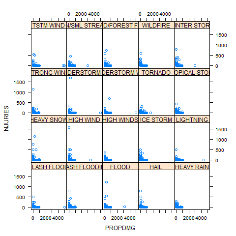

#Synopsis
This report estabilished for comparison between all events in USA. Events causes human and Economic resources damages. The simulation resaults shows high health and Econonmic damage rate in events like Tornado, Flash Floods and TSTM winds.

#Data Processing

This project involves exploring the U.S. National Oceanic and Atmospheric Administration's (NOAA) storm database than could be downloaded from here:
https://d396qusza40orc.cloudfront.net/repdata%2Fdata%2FStormData.csv.bz2

Here you will find how some of the variables are constructed/defined

###### National Weather Service Storm Data Documentation
https://d396qusza40orc.cloudfront.net/repdata%2Fpeer2_doc%2Fpd01016005curr.pdf

###### National Climatic Data Center Storm Events
https://d396qusza40orc.cloudfront.net/repdata%2Fpeer2_doc%2FNCDC%20Storm%20Events-FAQ%20Page.pdf


```{r, echo=FALSE,results='hide', message=FALSE}
setwd(file.path("D:", "sbu", "RLearning", "reproducible research","programming2"))
library(dplyr);library(xtable);library(lubridate)
StormData<-read.csv("repdata_data_StormData.csv",sep=",")
```

#Simulation Results
With respect to population health data base could be separated via specific Events, also the Date variable could be repaired to be used in future analysis as bellow:

```{r, results='asis', echo =TRUE}
set.seed(123)
newd<-gsub(" ","",as.character(StormData$BGN_DATE))
newd<-gsub("0:00:00","",newd)
newd<-as.Date(newd,format='%m/%d/%Y')
StormData$BGN_DATE<-(factor(newd))
colnames(StormData)<-gsub("EVTYPE","Type.of.Events",as.character(colnames(StormData)))
DataSample<-tbl_df(StormData)
By_EVTYPE<-group_by(DataSample,Type.of.Events)
```

######There are a lot of events that causes critical health effects thata we refer to top 20 Events as bellow:

```{r, results='markup', echo=FALSE}
events<-19
healthSum<-summarize(By_EVTYPE,Total.Injureis=sum(INJURIES))
healthSum<-arrange(healthSum,desc(Total.Injureis))
others<-sum(healthSum$Total.Injureis[(events+1):nrow(healthSum)])
HeSum<-matrix(rep(0,2*(events+1)),(events+1),2)
HeSum[,1]<-c(as.character(healthSum$Type.of.Events[1:events]),"others")
HeSum[,2]<-c(healthSum$Total.Injureis[1:events], others)
HeSum<-data.frame(HeSum)
colnames(HeSum)<-c("Type.of.Events","Total.Economic.Injureis")
xtable(HeSum, caption = "Top 20 Most injuries by events")
HeSum
```

######The Economic effects of Events sorted via PROPDMG in NOAA lists of variables that shows high impact of Tornado on Economic indexes.

```{r, results='markup', echo=FALSE}
events<-19
EconomicSum<-summarize(By_EVTYPE,Total.Economic.Damages=sum(PROPDMG))
EconomicSum<-arrange(EconomicSum,desc(Total.Economic.Damages))
others<-sum(EconomicSum$Total.Economic.Damages[(events+1):nrow(EconomicSum)])
EcSum<-matrix(rep(0,2*(events+1)),(events+1),2)
EcSum[,1]<-c(as.character(EconomicSum$Type.of.Events[1:events]),"others")
EcSum[,2]<-c(EconomicSum$Total.Economic.Damages[1:events], others)
EcSum<-data.frame(EcSum)
colnames(EcSum)<-c("Type.of.Events","Total.Economic.Damage")
xtable(EcSum, caption = "Top 20 Economic Damaged events")
EcSum
```

######Highest impact on Economic and people health demonstrated by Events like Tornado and TSTM winds:

```{r, echo=FALSE}
events<-19
TonadoEvent<-grep("TORNADO", as.character(DataSample$Type.of.Events))
TornadoData<-DataSample[TonadoEvent,]
By_Year<-group_by(TornadoData, year=year(TornadoData$BGN_DATE))
TornadoSumDate<-summarize(By_Year, Total.Health.Effects=sum(INJURIES), Total.Economic.Damages=sum(PROPDMG))

xval<-TornadoSumDate$year
y1val<-TornadoSumDate$Total.Health.Effects
y2val<-TornadoSumDate$Total.Economic.Damages

par(mfrow = c(2, 1))
plot(xval,y1val, main="Health effect in Tornado Events By year",
     pch=20,type="l",col="blue",lwd="4",xlab="year",ylab="Injury rate"
     )
plot(xval,y2val, main="Economic effect in Tornado Events By year",
     pch=20,type="l",col="red",lwd="4", xlab="year",ylab="Economic rate")
```


```{r, echo=FALSE}
events<-19
TSTMEvent<-grep("TSTM WIND", as.character(DataSample$Type.of.Events))
TSTMData<-DataSample[TSTMEvent,]
By_Year<-group_by(TSTMData, year=year(TSTMData$BGN_DATE))
TSTMSumByDate<-summarize(By_Year, Total.Health.Effects=sum(INJURIES), Total.Economic.Damages=sum(PROPDMG))

xval<-TSTMSumByDate$year
y1val<-TSTMSumByDate$Total.Health.Effects
y2val<-TSTMSumByDate$Total.Economic.Damages

par(mfrow = c(2, 1))
plot(xval,y1val, main="Health effect in TSTM wind Events By year",
     pch=20,type="l",col="blue",lwd="4",xlab="year",ylab="Injury rate"
     )
plot(xval,y2val, main="Economic effect in TSTM wind Events By year",
     pch=20,type="l",col="red",lwd="4", xlab="year",ylab="Economic rate")
```

######Finally all events could be interpreted as one figure that shows the relationship between Economic Injury effects by type of events:




