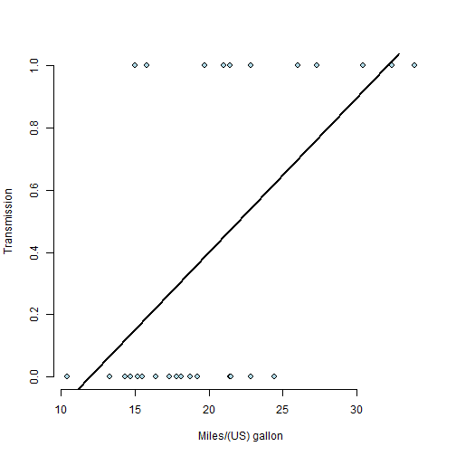

## Miles Per Gallon (MPG) in different Transmissions

This study is about the automobile industry. Looking at a data set of a collection of cars, exploring the relationship between a set of variables and miles per gallon (MPG) (outcome) implemented by some exploratory analysis.

--- 
## Automatic and Manual Transmission comparison
The result shows higher fuel consumption of automatic automobiles in comparison to manual automobiles.

```r
mean(mtcars$disp[mtcars$am==1]) #Mean MPG in Automatic automobiles 
```

```
## [1] 143.5308
```

```r
mean(mtcars$disp[mtcars$am==0]) #Mean MPG in Manual automobiles
```

```
## [1] 290.3789
```

---
## Automatic and Manual Transmission Base Plot
The result shows higher fuel consumption of automatic automobiles in comparison to manual automobiles.
 


---
## Conclusion
- The Figure shows high Fuel consumption in Automatic versus Manual Transmission.
- Mean value of miles per galon in both Transmission shows that mpg in Manual Transmission is two times larger than automatic counterpart.


