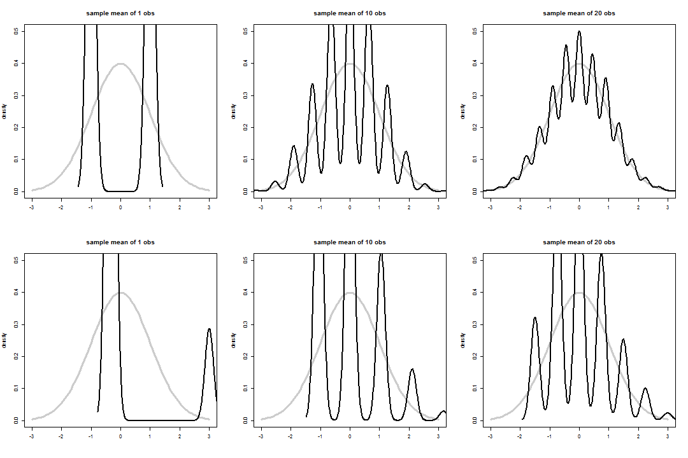

Central Limit Theorem(CLT)
========================================================
author: MT
date: 2015/07/20

Central Limit Theorem(CLT)
========================================================

In probability theory, the central limit theorem (CLT) states that, given certain conditions, the arithmetic mean of a sufficiently large number of iterates of independent random variables, each with a well-defined expected value and well-defined variance, will be approximately normally distributed, regardless of the underlying distribution.

Central Limit Theorem(CLT)
========================================================
In more general probability theory, a central limit theorem is any of a set of weak-convergence theorems. They all express the fact that a sum of many independent and identically distributed (i.i.d.) random variables, or alternatively, random variables with specific types of dependence, will tend to be distributed according to one of a small set of attractor distributions.

Means by Different Observation
========================================================
 
Conclusion
========================================================
The central limit theorem gives only an asymptotic distribution. As an approximation for a finite number of observations, it provides a reasonable approximation only when close to the peak of the normal distribution; it requires a very large number of observations to stretch into the tails.
